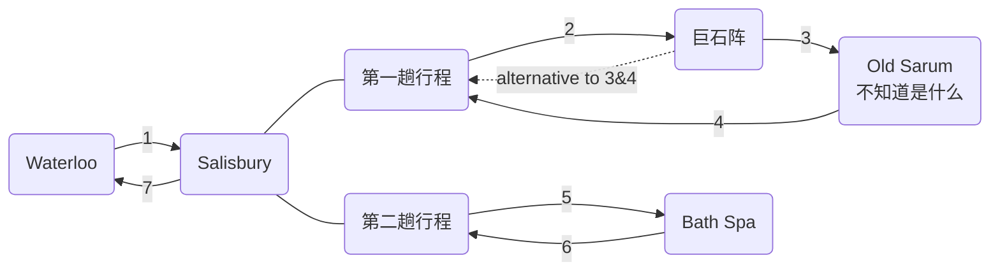

[toc]

> Updated 23-03-23 

# 行程安排（序号对照图片）

## 1

火车一个半小时直达。

票价32磅左右。

8:20出发的可能比较合适

> 可以看看往返票

## 2

- 交通选择一

  整点发车的公交车。小红书说往返套票是35/39磅？

- 交通选择二

  打车，刚刚凌晨查了一下价格单程23磅左右。

## 5 & 6

单程一小时直达，票价14.5磅左右。

> 可以看看往返票

## 7

火车一个半小时直达。

票价20磅左右。

# 参考链接

[伦敦周边游｜巨石阵➕巴斯 - 小红书](https://www.xiaohongshu.com/explore/63f1e9200000000014025f55?app_platform=ios&app_version=7.56.1&share_from_user_hidden=true&type=normal&xhsshare=WeixinSession&appuid=5b0fc4d8e8ac2b7f69b1119e&apptime=1679538558)

[🇬🇧伦敦➡️巨石阵+巴斯 一日游 - 小红书](https://www.xiaohongshu.com/explore/616b4154000000002103aad3?app_platform=ios&app_version=7.56.1&share_from_user_hidden=true&type=normal&xhsshare=WeixinSession&appuid=5b0fc4d8e8ac2b7f69b1119e&apptime=1679538678)

[一日游团 - 飞猪](https://market.m.taobao.com/app/trip/rx-travel-detail/pages/index?__password=￥hTO8dQQwbKc￥&id=707571904487&shareId=weixin_friend_card&_projVer=1.2.30)